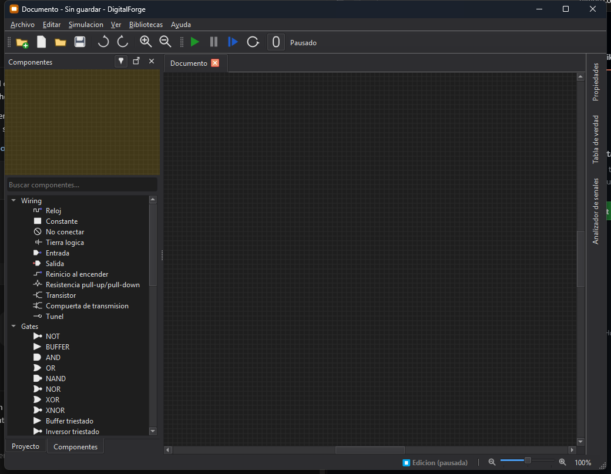
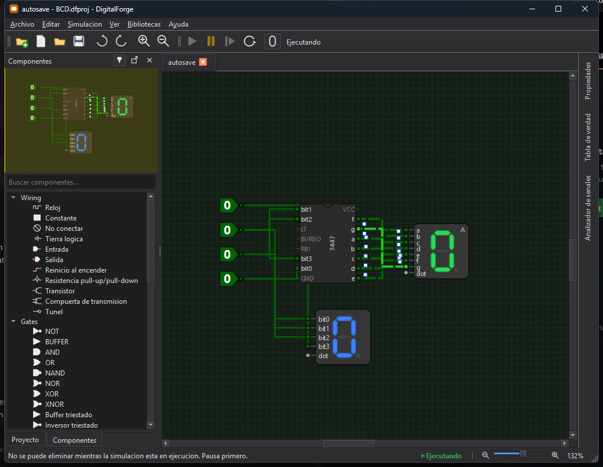

# Guía de uso

## Área de trabajo

La ventana principal combina el lienzo con varios paneles acoplables:

- **Paleta de componentes:** catálogo de componentes disponibles.
- **Árbol del proyecto:** documentos que forman el proyecto.
- **Propiedades:** configuración del componente seleccionado.
- **Minimapa:** vista general del circuito.
- **Tabla de verdad:** evaluación de combinaciones de entrada.
- **Formas de onda:** historial de señales seleccionadas.

La disposición predeterminada puede restaurarse y el zoom admite valores entre
10 % y 400 %.

## Edición

El editor permite colocar, seleccionar, mover, rotar y eliminar componentes.
Las operaciones de edición principales admiten deshacer y rehacer. Los cables
son ortogonales, se enrutan automáticamente y sus esquinas se pueden ajustar.

## Simulación

El motor es dirigido por eventos y ofrece iniciar, pausar, reiniciar, avanzar
un paso y ejecutar hasta alcanzar un estado estable. Detecta oscilaciones,
eventos repetidos y conflictos entre varias salidas.

### Estados lógicos

| Estado | Significado |
|---|---|
| `0` | Nivel lógico bajo |
| `1` | Nivel lógico alto |
| `Z` | Alta impedancia |
| `X` | Valor desconocido |
| `Error` | Conflicto u otra condición inválida |

## Proyectos y documentos

Un archivo `.dfproj` describe un proyecto con uno o más documentos `.dfc`.
Un documento guardado puede utilizarse como subcircuito dentro de otro
documento del mismo proyecto.

En la versión actual:

- los pines del subcircuito se derivan de sus componentes Entrada y Salida;
- el orden se calcula por posición vertical y luego horizontal;
- solo se admite un nivel de anidamiento;
- el documento destino debe tener una ruta guardada;
- los cambios de interfaz del documento referenciado no se propagan
  automáticamente mientras está abierto.

## Importar desde Logisim

DigitalForge incluye un importador de circuitos de Logisim. Revisa el circuito
después de importar, especialmente si utiliza funciones que aún no existen en
DigitalForge, como buses reales de múltiples bits.
