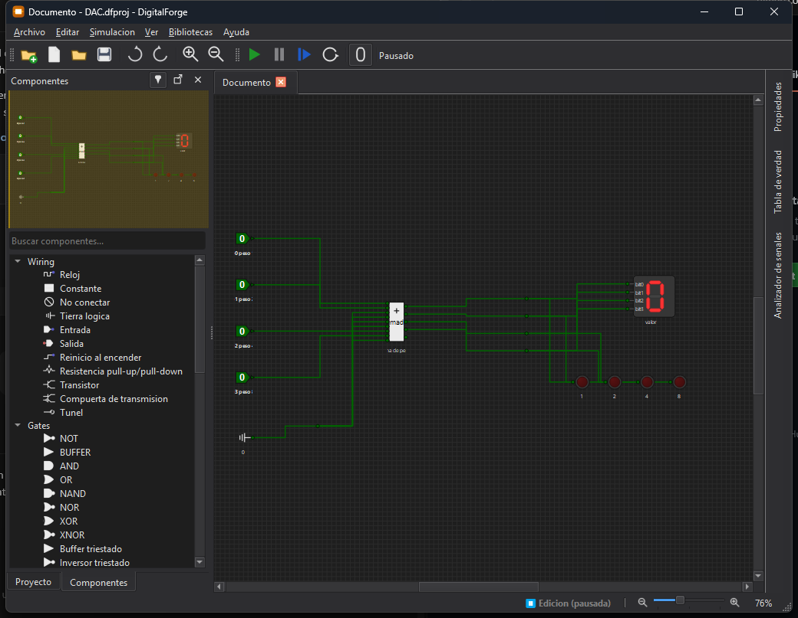

# Primeros pasos

Esta guía crea un circuito AND sencillo con dos entradas y una salida.

## 1. Crear un proyecto

Selecciona **Archivo → Nuevo proyecto…**. El proyecto puede contener varios
documentos de circuito (`.dfc`) y un manifiesto (`.dfproj`).

## 2. Colocar componentes

Desde la paleta, agrega:

- dos componentes **Entrada**;
- una compuerta **AND**;
- un componente **Salida** o un **LED**.

Los componentes se ajustan a la rejilla del lienzo.

## 3. Cablear

Usa la herramienta de cable para unir las dos entradas con los pines de la
compuerta AND y la salida de la compuerta con el LED o la salida. DigitalForge
crea recorridos ortogonales automáticamente.

*Ejemplo de un proyecto DAC con entradas, un componente personalizado,
visualización hexadecimal y salidas LED.*

## 4. Simular

Inicia la simulación desde la barra de herramientas. Activa y desactiva las
entradas haciendo clic sobre ellas. La salida de una AND solo toma el valor `1`
cuando ambas entradas están en `1`.

Los cables cambian de color para mostrar su estado lógico. Además de `0` y `1`,
el simulador representa alta impedancia (`Z`), valor desconocido (`X`) y
conflicto (`Error`).

*Circuito BCD en ejecución. Los cables y terminales muestran en tiempo real los
estados propagados.*

## 5. Analizar

- Abre la **Tabla de verdad** para recorrer las combinaciones de entrada.
- Agrega redes al panel de **Formas de onda** para observar cambios en el
  tiempo.
- Usa una **Sonda** para inspeccionar una señal.

## 6. Guardar

Guarda el proyecto. DigitalForge escribe los documentos del circuito, el
manifiesto del proyecto y `digitalforge.lock.json`, que registra las versiones
y huellas de los componentes utilizados.
